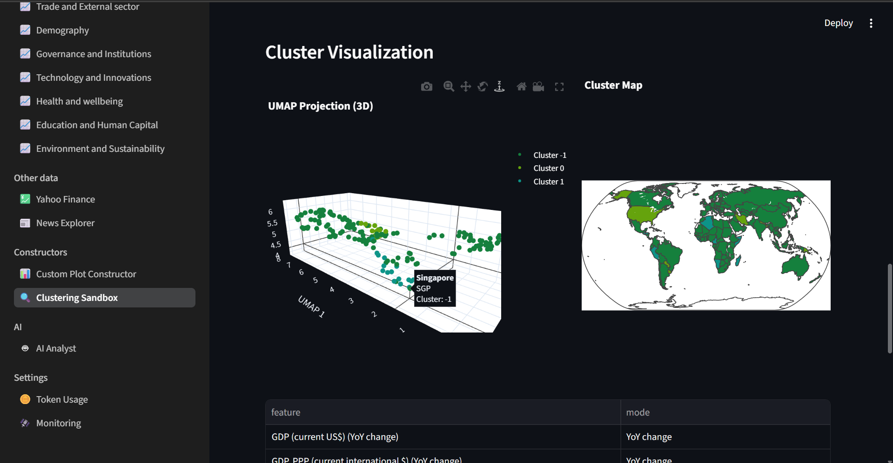
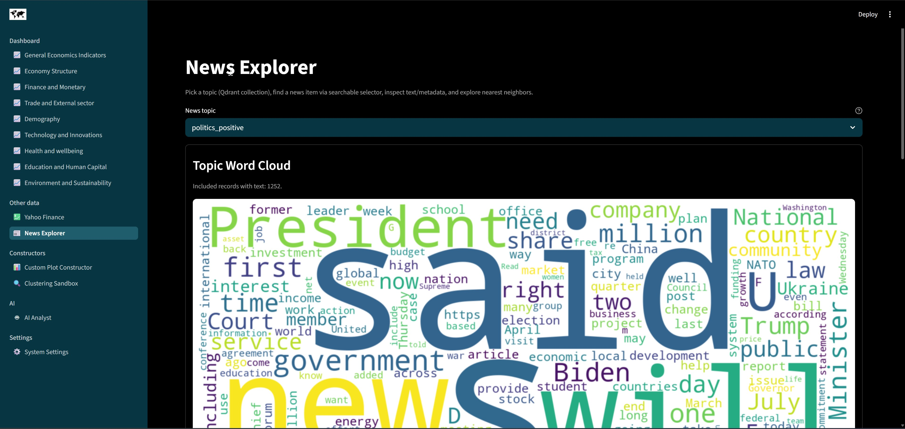
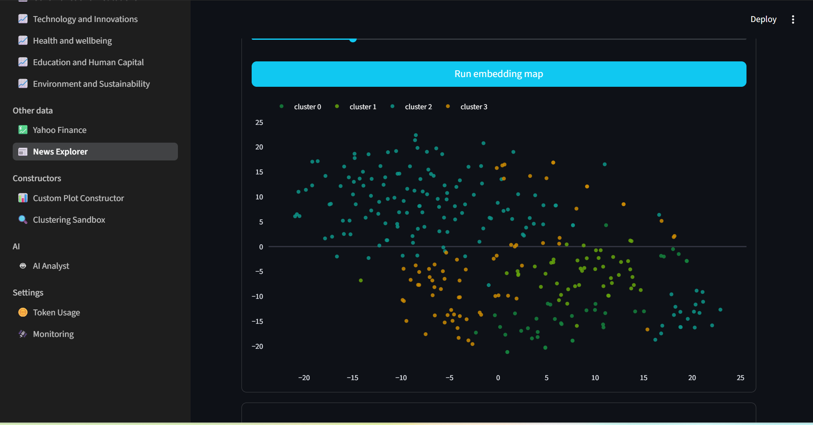

# Ultimate Macroeconomics Dashboard

Technical stack used in the application or during development (not exhaustive):


## Description

[`Ultimate Macroeconomics Dashboard`](https://github.com/alexveider1/Ultimate-Macroeconomics-Dashboard) is an AI-powered analytical system for macroeconomic data, packaged as an interactive multi-page dashboard. It combines more than **70** indicators from the [`World Bank Data API`](https://data360.worldbank.org/en/search), more than **30 000** news articles from the open [`Webz.io`](https://github.com/Webhose/free-news-datasets) repository, and more than **50** companies and **9** indices from [`Yahoo Finance`](https://finance.yahoo.com/). The UI is built on `streamlit` and `plotly` and ships with **80+** ready-made interactive plots, a multi-agent AI analyst, semantic search over news (RAG), time-series forecasting, and unsupervised clustering.

The project follows a strict micro-service design and is composed of 10 `Docker` containers, each responsible for one capability:

* `db` — relational database (`PostgreSQL`) for tabular data from `World Bank Data API` and `Yahoo Finance`.
* `vector_db` — vector database (`Qdrant`) for news article embeddings sourced from the `Webz.io` open dataset.
* `db_init` — short-lived container that bootstraps `PostgreSQL` users, schemas and grants.
* `downloader_general` — one-shot job that fetches the initial dataset (World Bank, Yahoo Finance, news) into the databases.
* `app` — the `Streamlit` dashboard itself (this is what the user opens in the browser).
* `agent` — `FastAPI` backend hosting the multi-agent AI analyst (LangGraph supervisor + specialised workers).
* `forecaster` — `FastAPI` micro-service for time-series forecasting (`pmdarima`, `prophet`, `chronos`).
* `clustering` — `FastAPI` micro-service for unsupervised clustering (KMeans, DBSCAN).
* `downloader_extra` — `FastAPI` micro-service that downloads additional World Bank indicators on demand.
* `python_sandbox` — `FastAPI` sandbox that executes LLM-generated code in an isolated environment.

## Illustrations

|                               |                                  |
| ----------------------------- | -------------------------------- |
|  |  |
|       |             |
|          |             |
|          |             |
|          |             |
|          |             |

## LLM Requirements

The dashboard relies heavily on agentic infrastructure, so the LLM you connect must satisfy a specific feature set. These requirements are met by virtually every recent flagship model from major providers (`OpenAI`, `Google`, `Anthropic`, `Qwen`, `DeepSeek`). Older models or models from smaller providers may break some functionality. Powerful cloud models from paid APIs are recommended; local models served via [`vLLM`](https://github.com/vllm-project/vllm) on a high-performance GPU also work.

* Reasoning capability.
* Tool / function calling.
* Vision (the AI Analyst can read rendered Plotly charts as images).
* Long context: $\geq 256\text{k}$ tokens (the application has been tested on `gpt-5.4` with a 1M-token context).

## Getting started

`Ultimate Macroeconomics Dashboard` requires only `Docker` (with the Compose plugin) on the host.

### 1. GPU note

If your host does **not** have an NVIDIA GPU available to Docker, open `docker-compose.yaml`, find the `forecaster` service and remove (or comment out) the `deploy` block:

```yaml
    # remove `deploy` part if no GPU available
    deploy:
      resources:
        reservations:
          devices:
            - driver: nvidia
              count: all
              capabilities: [gpu]
```

The forecaster will then fall back to CPU-only models (`pmdarima`, `prophet`).

### 2. Clone the repository

```bash
git clone https://github.com/alexveider1/Ultimate-Macroeconomics-Dashboard
cd Ultimate-Macroeconomics-Dashboard/
```

### 3. Configure the LLM

Edit `_container_data/config.yaml` and set the LLM and embedding parameters under the `shared` key. Any OpenAI-compatible provider works:

```yaml
shared:
    ...
    openai_base_url: https://api.openai.com/v1
    openai_llm_model: gpt-5.4
    openai_embedding_model: openai/text-embedding-3-small
    openai_embedding_model_max_tokens: 8192
    openai_embedding_model_dimensions: 1536
```

### 4. Create the `.env` file

Create `_container_data/.env` with your secrets (you can copy `_container_data/.env.example` as a starting point):

```
POSTGRES_USERNAME=username
POSTGRES_PASSWORD=password

POSTGRES_LLM_USERNAME=llm_username
POSTGRES_LLM_PASSWORD=llm_password

QDRANT__SERVICE__API_KEY=some_api_key

OPENAI_API_KEY=some_api_key
```

| Variable                   | Used by                       | Purpose                                                                 |
| -------------------------- | ----------------------------- | ----------------------------------------------------------------------- |
| `POSTGRES_USERNAME`        | `db`, `db_init`               | Superuser created at first boot.                                        |
| `POSTGRES_PASSWORD`        | `db`, `db_init`               | Password for the superuser above.                                       |
| `POSTGRES_LLM_USERNAME`    | `db_init`, `agent`            | Read-only role used by the AI analyst to query the database.            |
| `POSTGRES_LLM_PASSWORD`    | `db_init`, `agent`            | Password for the read-only role.                                        |
| `QDRANT__SERVICE__API_KEY` | `vector_db`, `agent`, `app`   | Bearer token protecting the Qdrant HTTP API.                            |
| `OPENAI_API_KEY`           | `agent`                       | API key passed to the LLM/embedding provider configured in `config.yaml`. |

> **Important:** never share `_container_data/.env` or commit it to version control.

### 5. Build and run

```bash
docker compose up --build
```

The first build takes about 5–10 minutes (Python wheels + model downloads). The initial data ingestion that runs afterwards (`downloader_general`) takes roughly 1–2 hours, depending on your network and how many news articles are imported.

Once the stack is running, open `http://localhost:8501` in your browser — the dashboard should appear.

## Configuration

### `config.yaml`

`Ultimate Macroeconomics Dashboard` is highly configurable via `_container_data/config.yaml`. You can change the generative LLM, the embedding model, the LLM provider (any OpenAI-compatible API), forecasting models, log paths, and more. The default configuration is:

```yaml
shared:
  data_root: _container_data
  env_file: _container_data/.env
  world_bank_download_config: _configs/world_bank_download_config.json
  news_download_config: _configs/news_download_config.json
  yahoo_download_config: _configs/yahoo_download_config.json
  openai_base_url: https://api.openai.com/v1
  openai_llm_model: gpt-5.4
  openai_embedding_model: openai/text-embedding-3-small
  openai_embedding_model_max_tokens: 8192
  openai_embedding_model_dimensions: 1536
services:
  app:
    host_sync_dir: _container_data/app
  agent:
    host_sync_dir: _container_data/agent
  downloader_general:
    host_sync_dir: _container_data/downloader_general
  downloader_extra:
    host_sync_dir: _container_data/downloader_extra
  forecaster:
    host_sync_dir: _container_data/forecaster
  python_sandbox:
    host_sync_dir: _container_data/python_sandbox
  clustering:
    host_sync_dir: _container_data/clustering
postgres:
  host: db
  port: 5432
  database: postgres
qdrant:
  host: vector_db
  port: 6333
downloader_general:
  repo_url: https://github.com/Webhose/free-news-datasets.git
app:
  port: 8501
agent:
  port: 8000
forecaster:
  port: 8001
  ARIMA_AVAILABLE: true
  PROPHET_AVAILABLE: true
  CHRONOS_AVAILABLE: true
  CHRONOS_MODEL: amazon/chronos-t5-tiny
clustering:
  port: 8002
downloader_extra:
  port: 8003
python_sandbox:
  port: 8004
```

`config.yaml` exposes 11 top-level sections:

* `shared` — values used by every container. The most useful keys are `openai_base_url` (LLM provider endpoint), `openai_llm_model` (chat / agent model) and `openai_embedding_model` (embedding model used for RAG).
* `services` — bind-mount paths between the host and each container.
* `postgres` — `port` and `database` for the relational database. The schema is documented in `_container_data/database_schema.yaml` and can be reused outside the dashboard for research purposes.
* `qdrant` — connection parameters for the Qdrant vector database.
* `downloader_general` — one-time bootstrap job parameters.
* `app`, `agent`, `clustering`, `downloader_extra`, `python_sandbox` — fixed ports per service.
* `forecaster` — `ARIMA_AVAILABLE` toggles [`pmdarima`](https://github.com/alkaline-ml/pmdarima); `PROPHET_AVAILABLE` toggles [`prophet`](https://github.com/facebook/prophet); `CHRONOS_AVAILABLE` toggles [`chronos`](https://github.com/amazon-science/chronos-forecasting); `CHRONOS_MODEL` selects which Chronos checkpoint to load.

> **Note:** changing ports, host bind-mount paths, or other hard-coded parameters requires matching edits to `docker-compose.yaml`. Ad-hoc edits in only one place will leave the stack inconsistent.

### Custom theming

The active colour palette is controlled by `_container_data/themes.yaml`. The bundled themes (`dark`, `dark-blue`, `light-green`) drive both the Plotly chart template and the Streamlit page colours. To change the palette, set the `active` key:

```yaml
active: dark-blue
themes:
  dark:
    ...
  dark-blue:
    ...
  light-green:
    ...
```

Streamlit also reads its theme from `app/.streamlit/config.toml`. If you want to customise the dashboard chrome directly, edit it there:

```toml
[theme]
primaryColor = "#10c8f1"
backgroundColor = "#000000"
secondaryBackgroundColor = "#073642"
textColor = "#ffffff"
```

The runtime theme picker that previously lived on the Settings page has been removed in v0.6; theming is a deploy-time concern.

### Exposing the local dashboard on the network

If you want to expose the local-development version on your LAN, edit `app/.streamlit/config.toml`:

```toml
[server]
address = "0.0.0.0"
```

Setting `headless = true` is also recommended.

### Adding extra indicators

To add more World Bank indicators to the dashboard, append them to `_container_data/_configs/world_bank_download_config.json`. Each top-level key is one dashboard page:

```json
{
    "General Economics Indicators": [
        {
            "name": "GDP",
            "id": "NY.GDP.MKTP.CD",
            "db": 2
        },
        {
            "name": "GDP_PPP",
            "id": "NY.GDP.MKTP.PP.CD",
            "db": 2
        },
        ...
    ],
    ...
}
```

`downloader_general` will pick the new entries up on the next clean boot. Already-running stacks can fetch new indicators on demand via the AI analyst (which delegates to `downloader_extra`).

## Correctness of data

> **Important:** the developer of this dashboard is not responsible for the accuracy, completeness, or quality of the data and news displayed. All information is sourced from third-party providers and is presented as-is. It is the user's responsibility to evaluate whether any given source or data point is reliable before making decisions based on it.

## License

[](https://opensource.org/licenses/MIT)
