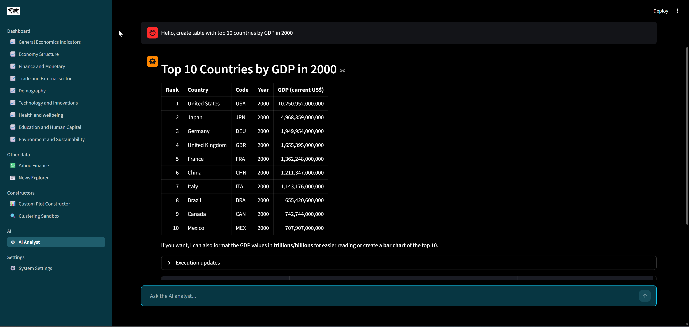
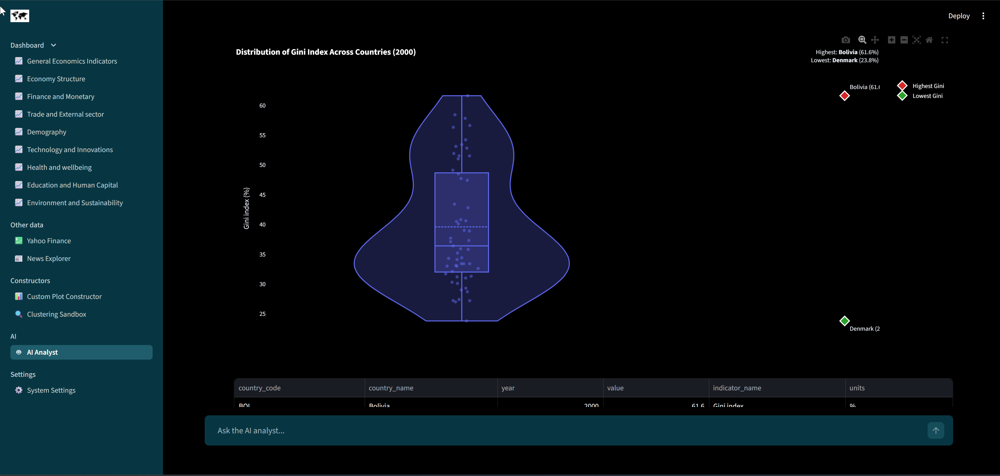
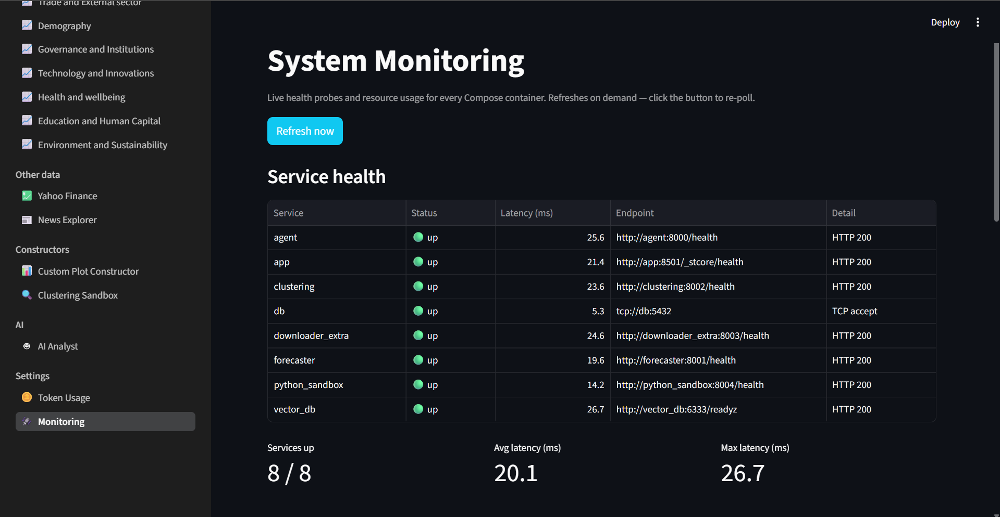
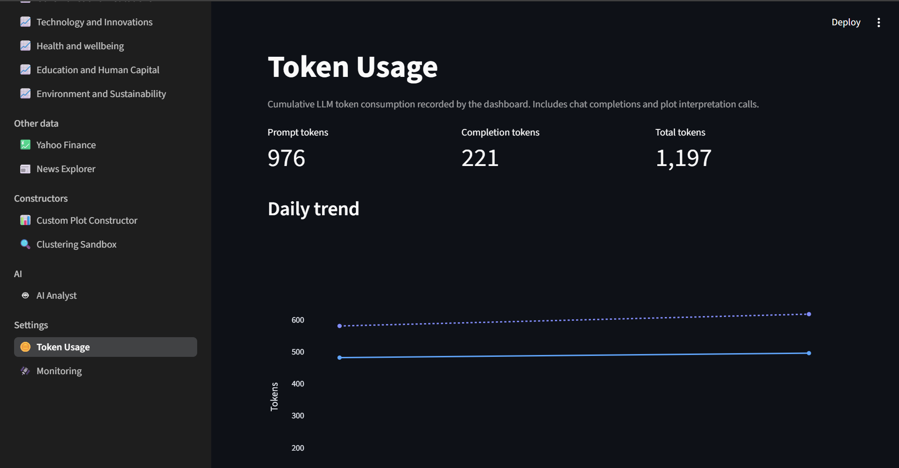
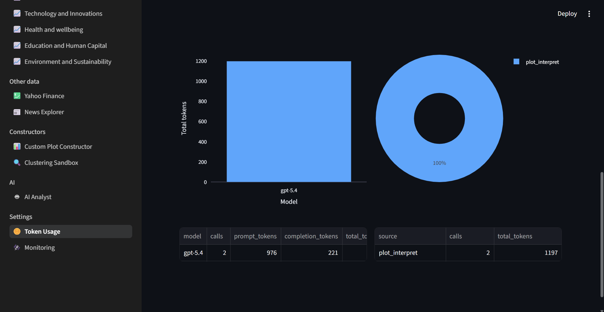

# Ultimate Macroeconomics Dashboard

Technical stack (not exhaustive):


[`Ultimate Macroeconomics Dashboard`](https://github.com/alexveider1/Ultimate-Macroeconomics-Dashboard) is an AI-powered macroeconomic analytics tool: a Streamlit dashboard backed by Postgres + Qdrant, plus FastAPI services for an AI analyst, forecasting, clustering, on-demand data ingestion, and a Python sandbox. **70+** World Bank indicators, **30 000+** news articles, **50+** Yahoo Finance tickers, **150+** prebuilt charts.

The full stack consists of 9 `Docker` containers — `db`, `vector_db`, `downloader_general`, `app`, `agent`, `forecaster`, `clustering`, `downloader_extra`, and `python_sandbox`. The project follows a strict micro-service design, with each container responsible for one capability:

* `db` — relational database (`PostgreSQL`) for tabular data from `World Bank Data API` and `Yahoo Finance`.
* `vector_db` — vector database (`Qdrant`) for news article embeddings sourced from the `Webz.io` open dataset.
* `downloader_general` — one-shot job that fetches the initial dataset (World Bank, Yahoo Finance, news) into the databases.
* `app` — the `Streamlit` dashboard itself (this is what the user opens in the browser).
* `agent` — `FastAPI` backend hosting the multi-agent AI analyst (LangGraph supervisor + specialised workers).
* `forecaster` — `FastAPI` micro-service for time-series forecasting (`pmdarima`, `prophet`, `chronos`).
* `clustering` — `FastAPI` micro-service for unsupervised clustering (KMeans, DBSCAN).
* `downloader_extra` — `FastAPI` micro-service that downloads additional World Bank indicators on demand.
* `python_sandbox` — `FastAPI` sandbox that executes LLM-generated code in an isolated environment.

## Quick start

Prerequisites: Docker (with the Compose plugin). An NVIDIA GPU is optional, though it significantly improves the forecaster's performance.

```bash
# 1. Clone repo
git clone https://github.com/alexveider1/Ultimate-Macroeconomics-Dashboard
cd Ultimate-Macroeconomics-Dashboard/

# 2. Create the `.env` file (fill in your secrets)
cp _container_data/.env.example _container_data/.env
$EDITOR _container_data/.env

# 3. Set the shared.openai_* keys in `_container_data/config.yaml`
$EDITOR _container_data/config.yaml

# 4. If no CUDA-capable GPU is available, remove the `deploy` block under `forecaster:` in docker-compose.yaml
$EDITOR docker-compose.yaml

# 5. Build and run
docker compose up --build
```

On first boot, the stack downloads the datasets and inserts them into both databases (relational and vector). How long this takes depends heavily on your network speed, but it usually takes around 30 minutes. The dashboard is not available while the data is downloading; once the download completes, it becomes available at <http://localhost:8501>.

### Required `.env` variables

| Variable                   | Purpose                                                                |
| -------------------------- | ---------------------------------------------------------------------- |
| `POSTGRES_USER`            | Postgres superuser created natively by the `postgres:18` image on first boot. |
| `POSTGRES_PASSWORD`        | Password for the superuser.                                            |
| `POSTGRES_DB`              | Default database created on first boot (typically `postgres`).         |
| `POSTGRES_LLM_USER`        | Read-only role used by the AI analyst and the dashboard's bulk reads to query the database. |
| `POSTGRES_LLM_PASSWORD`    | Password for the read-only role (rotatable; takes effect on next boot). |
| `QDRANT__SERVICE__API_KEY` | Bearer token protecting the Qdrant HTTP API.                           |
| `OPENAI_API_KEY`           | API key for the LLM/embedding provider in `config.yaml`.               |

> Never commit `_container_data/.env`

### Required `config.yaml` keys

Set these under `shared:` to point at your LLM provider (any OpenAI-compatible API works):

```yaml
shared:
  openai_base_url: https://api.openai.com/v1
  openai_llm_model: gpt-5.4
  openai_embedding_model: openai/text-embedding-3-small
```

Everything else has working defaults. See [`_container_data/config.yaml`](_container_data/config.yaml) for the full schema.

## LLM requirements

The agent needs a model with reasoning, tool/function calling, vision, and ≥256k context. Any recent flagship from OpenAI, Google, Anthropic, Qwen, or DeepSeek works. Local models served via [vLLM](https://github.com/vllm-project/vllm) on a powerful GPU also work.

## Illustrations

|                               |                                  |
| ----------------------------- | -------------------------------- |
|  |  |
|          |             |
|          |             |
|          |             |
|          |             |
|          |             |
|          |             |
|          |             |

## Custom theming

The active colour palette is controlled by `_container_data/themes.yaml`. The bundled themes (`dark`, `dark-blue`, `light-green`) drive both the Plotly chart template and the Streamlit page colours. To change the palette, set the `active` key:

```yaml
active: dark-blue
themes:
  dark:
    ...
  dark-blue:
    ...
  light-green:
    ...
```

Streamlit also reads its theme from `app/.streamlit/config.toml`. If you want to customise the dashboard chrome directly, edit it there:

```toml
[theme]
primaryColor = "#10c8f1"
backgroundColor = "#000000"
secondaryBackgroundColor = "#073642"
textColor = "#ffffff"
```

## Adding extra indicators

To add more World Bank indicators to the dashboard, append them to `_container_data/_configs/world_bank_download_config.json`. Each top-level key is one dashboard page:

```json
{
    "General Economics Indicators": [
        {
            "name": "GDP",
            "id": "NY.GDP.MKTP.CD",
            "db": 2
        },
        {
            "name": "GDP_PPP",
            "id": "NY.GDP.MKTP.PP.CD",
            "db": 2
        },
        ...
    ],
    ...
}
```

`downloader_general` will pick the new entries up on the next clean boot. Already-running stacks can fetch new indicators on demand via the AI analyst (which delegates to `downloader_extra`).

## Disclaimer

All data is sourced from third-party providers and presented as-is. The author makes no representations about its accuracy or completeness.

## License

[](https://opensource.org/licenses/MIT)
